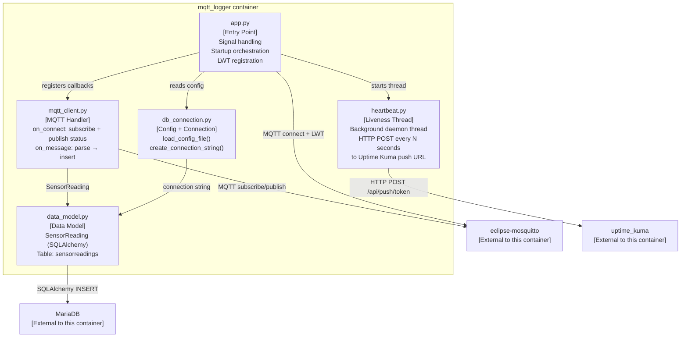
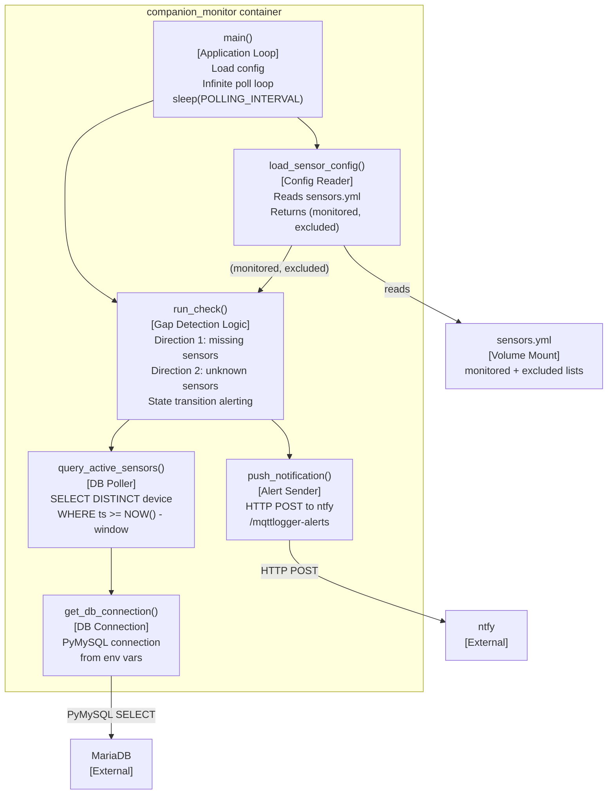

# View: Component (C4 Level 3)

**Viewtype:** Module — internal structure of key containers
**Answers:** How are mqtt_logger and companion_monitor internally structured?
**Audience:** Developers, detailed designers
**Related NFRs:** NFR-USE-002, NFR-REL-001, NFR-SEC-001

Only containers with significant internal complexity receive a Component view. `eclipse-mosquitto`, `mariadb`, `uptime_kuma`, and `ntfy` are third-party images with no owned internal structure.

---

## mqtt_logger Internal Structure

### Component Responsibilities

**app.py** — Process entry point. Loads configuration, configures rotating log file handler, registers the MQTT Last Will and Testament before connecting, starts the heartbeat background thread (if `heartbeat_url` is present), connects the MQTT client, and handles SIGTERM/SIGINT for graceful shutdown. All startup ordering is here.

**mqtt_client.py** — MQTT event handler. `on_connect` subscribes to `environment/#` and publishes `"online"` to the status topic. `on_message` parses the payload (JSON), constructs a `SensorReading`, opens a SQLAlchemy session, and commits the insert. If the commit fails, the error is logged and the message is discarded. This is the hot path — called for every message.

**heartbeat.py** — Background daemon thread. Loops forever: sleep N seconds, HTTP POST to the configured Uptime Kuma push URL. Exits automatically when the main process exits (daemon thread). No state; no retry logic on failed push (transient ntfy/UK failures are tolerated).

**data_model.py** — SQLAlchemy declarative model for the `sensorreadings` table. Fields: `id` (PK), `device` (topic path), `currentdate`, `currenttime`, `value`, `field1`–`field4`. The schema is owned by this model; changes require a migration script (NFR-INT-001).

**db_connection.py** — Configuration loading and connection string construction. `load_config_file()` reads `config.json` and raises descriptive errors on missing/invalid fields (NFR-USE-001). `create_connection_string()` builds the SQLAlchemy connection URL from the loaded config.

---

## companion_monitor Internal Structure

### Component Responsibilities

**main()** — Startup and poll loop. Loads sensor configuration once at start (changes require container restart). Runs `run_check()` every `POLLING_INTERVAL_SECONDS` (default 300). The `alerted_missing` and `alerted_unknown` sets live in `main()` scope and persist across poll cycles — this is the state that enables transition-only alerting.

**load_sensor_config()** — Reads `sensors.yml`. Returns two collections: `monitored` (periodic sensors subject to gap checking) and `excluded` (event-driven sensors suppressed from both gap and unknown alerts). Raises on empty `sensors` list.

**run_check()** — Core detection logic. Calls `query_active_sensors()` to get the set of devices that have published within `GAP_WINDOW_MINUTES`. Computes set differences to find newly missing, newly recovered, newly unknown, and newly resolved sensors. Fires notifications only on state transitions. Logs at INFO on state change; demotes to DEBUG on quiet cycles.

**query_active_sensors()** — Single SQL query: `SELECT DISTINCT device FROM sensorreadings WHERE TIMESTAMP(currentdate, currenttime) >= DATE_SUB(NOW(), INTERVAL N MINUTE)`. Returns a Python set of device topic strings.

**push_notification()** — HTTP POST to the configured `NTFY_URL`. Silently logs a warning and returns if `NTFY_URL` is empty. Logs delivery errors but does not retry.

**get_db_connection()** — Returns a PyMySQL connection from environment variables. Called fresh on each `run_check()` invocation — no persistent connection pooling (avoids stale connection issues on the 5-minute poll cycle).
