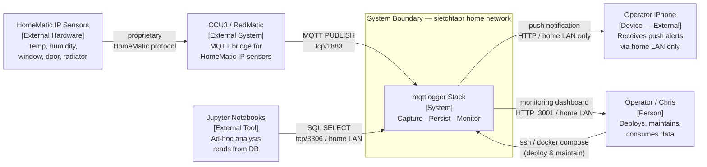

# View: System Context (C4 Level 1)

**Viewtype:** Allocation — system boundary
**Answers:** What is the mqttlogger system and what does it interact with?
**Audience:** All stakeholders
**Related NFRs:** NFR-PORT-001, NFR-SEC-001, FR-MON-006

---

## Diagram

---

## Key Elements

**System (mqttlogger Stack):** The deployable unit — six Docker containers running on a single Linux host on the private home network. Captures every MQTT sensor reading, persists it to MariaDB, and monitors the health of both the logger process and individual sensor streams.

**CCU3 / RedMatic:** The HomeMatic central control unit running the RedMatic firmware bridge. Translates HomeMatic IP sensor readings into MQTT messages and publishes them to the broker. Known to publish zero values for all sensors on restart (RISK-012). Independently operated — no changes to CCU3 are in scope.

**HomeMatic IP Sensors:** The physical measurement devices (temperature, humidity, window/door contacts, radiator controllers). Out of scope; they are the data source. Approximately 50 devices.

**Operator / Chris:** The sole person who deploys, maintains, and benefits from the system. Also STK-002 (future maintainer — the same person returning after months away). The only human interaction with the system.

**Operator iPhone:** The operator's mobile device running the ntfy app. Receives push alerts from the self-hosted ntfy server over the home LAN. **Notification delivery requires the device to be connected to the home Wi-Fi network** — LAN-only path; no cloud relay (RISK-023, FR-MON-006).

**Jupyter Notebooks:** External ad-hoc analysis tool. Reads directly from MariaDB for exploratory data analysis. Not a real-time consumer; no write access.

---

## System Boundary Notes

The system boundary is drawn to include all six Docker containers:
`mqtt` (broker) · `mqtt_logger` · `mariadb` · `uptime_kuma` · `ntfy` · `companion_monitor`

The boundary excludes: HomeMatic sensors, CCU3/RedMatic, the operator's devices, Jupyter notebooks, and all internet-facing systems (none are used).

The system has **no internet dependency**. All communication paths are on the private home LAN (192.168.x.x). This is a hard architectural constraint (explore-summary.md, solution set boundaries).
