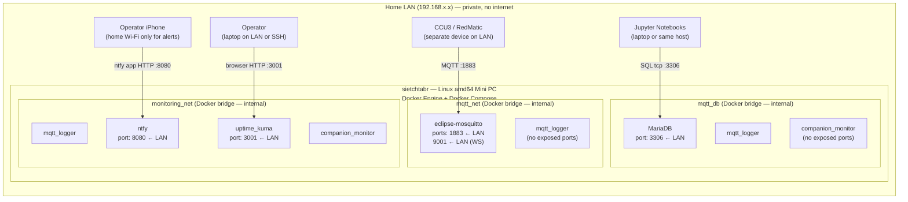

# View: Deployment / Allocation

**Viewtype:** Allocation — software to infrastructure
**Answers:** Where does each container run, on what hardware, via what network paths?
**Audience:** Operations, infrastructure
**Related NFRs:** NFR-PORT-001, NFR-REL-001, NFR-REL-002, NFR-SEC-001, FR-MON-006

---

## Diagram

*Note: `mqtt_logger` and `companion_monitor` each appear in multiple network subgraphs because Docker assigns each container one virtual interface per network. They are single containers with multiple network attachments.*

---

## Node Descriptions

### sietchtabr — Linux amd64 Mini PC

| Property | Value |
|----------|-------|
| Hardware | Consumer-grade x86 mini PC |
| OS | Linux (amd64) |
| Runtime | Docker Engine + Docker Compose |
| Power | Residential supply — no UPS; BIOS auto-restart not configured (OI-001) |
| Uptime goal | 24/7 continuous |
| Location | Home, private LAN |
| Internet access | Not used by any container |

All six Docker containers run on this single host. There is no multi-host deployment. This is a deliberate constraint (solo maintainer, home network, cost = zero).

### Docker Networks

| Network | Type | Members | Traffic |
|---------|------|---------|---------|
| `mqtt_net` | Bridge (internal) | mosquitto, mqtt_logger | MQTT publish/subscribe |
| `mqtt_db` | Bridge (internal) | mqtt_logger, mariadb, companion_monitor | SQL read/write |
| `monitoring_net` | Bridge (internal) | mqtt_logger, uptime_kuma, ntfy, companion_monitor | Heartbeat push, alert HTTP |

No container is on the internet. All inter-container communication is on Docker internal bridge networks. External-facing ports are LAN-accessible only (no firewall rules expose them to the internet).

---

## Port Exposure Summary

| Container | Exposed Port | Protocol | Accessible From | Purpose |
|-----------|-------------|----------|-----------------|---------|
| eclipse-mosquitto | 1883 | MQTT/TCP | LAN (CCU3 publishes here) | Sensor data ingestion |
| eclipse-mosquitto | 9001 | MQTT/WS | LAN | WebSocket MQTT (optional) |
| MariaDB | 3306 | MySQL/TCP | LAN | Jupyter notebook queries |
| uptime_kuma | 3001 | HTTP | LAN | Operator dashboard |
| ntfy | 8080 | HTTP | LAN | ntfy app push subscription |
| mqtt_logger | — | — | — | No exposed ports |
| companion_monitor | — | — | — | No exposed ports |

---

## Trust Boundaries

**Internal Docker network (trusted):** All inter-container communication on `mqtt_net`, `mqtt_db`, `monitoring_net`. No TLS; containers trust each other. The threat model assumes the Docker network is not exposed externally.

**LAN boundary (semi-trusted):** Ports 1883, 3306, 3001, 8080 are accessible from any device on the home LAN. Credentials protect 3306 (MariaDB). Ports 1883, 3001, 8080 have no authentication in the current deployment.

**Internet boundary (not crossed):** No container initiates or accepts internet connections. No firewall port forwarding is configured. This is a hard architectural constraint — it is the primary mechanism satisfying the "no cloud dependency" requirement from the explore-summary.

---

## Recovery and Restart Topology

All containers are configured with `restart: unless-stopped`. Restart order on host boot:
1. `mqtt` and `mariadb` start first (no dependency)
2. `mqtt_logger` starts after `mariadb` healthcheck passes (`depends_on: condition: service_healthy`)
3. `companion_monitor` starts after `mariadb` healthcheck passes
4. `uptime_kuma` and `ntfy` start independently (no DB dependency)

The mariadb healthcheck (`mysqladmin ping`) with 30s interval, 10s timeout, 3 retries means mqtt_logger waits up to ~90 seconds for the database to be ready before connecting. This satisfies NFR-REL-002 (recovery ≤ 60s) only when the database is already healthy — if MariaDB itself needs to recover, the logger waits.
