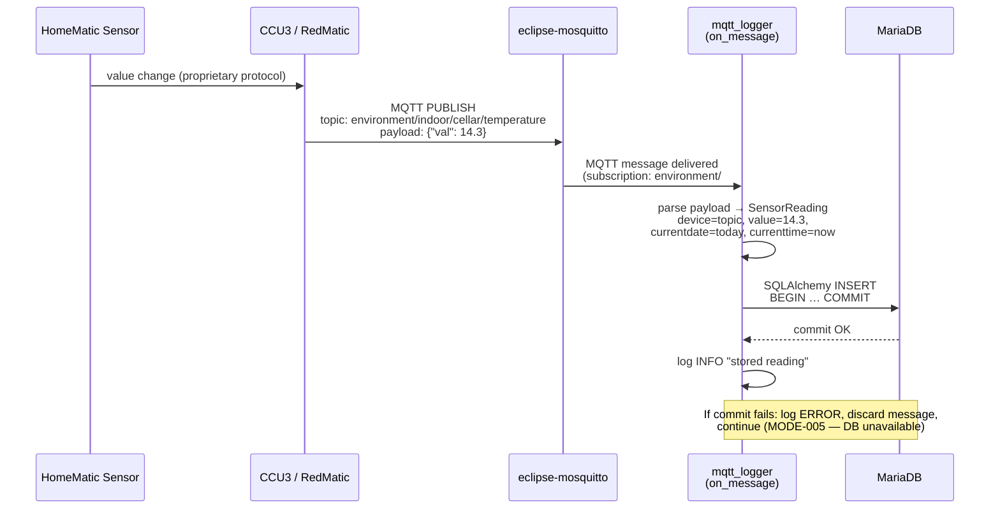
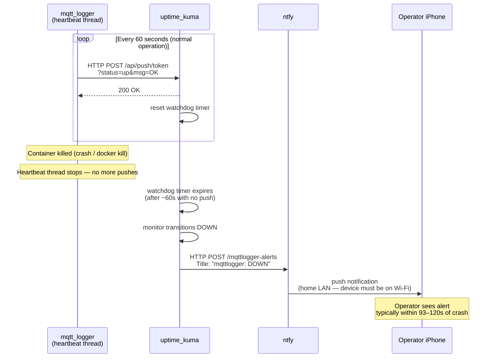
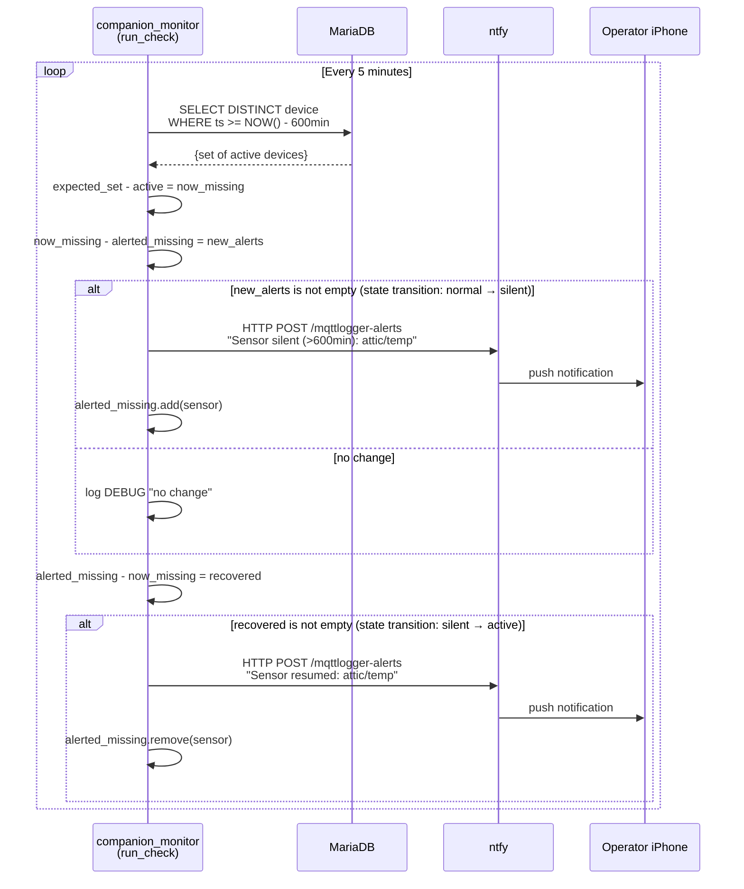
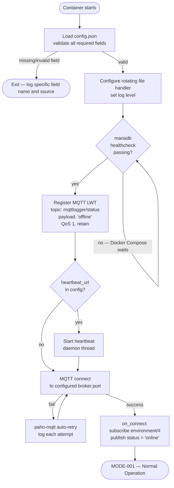
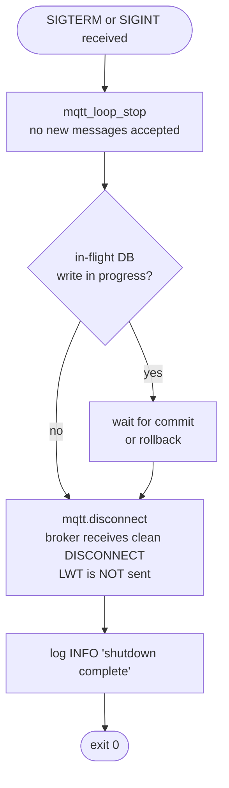

# View: Functional Flow

**Viewtype:** Component-and-Connector — behaviour over time
**Answers:** How do functions activate and interact for each key operational scenario?
**Audience:** Systems engineers, testers
**Related scenarios:** SCN-001, SCN-003 (with monitoring), SCN-005

---

## Flow 1 — Normal Message Capture (SCN-001, MODE-001)

Shows the end-to-end path from sensor measurement to committed database record during steady-state operation.

---

## Flow 2 — Crash Detection and Notification (SCN-003 + OPT-A)

Shows how a silent container crash is detected and the operator is notified. Two sub-flows: the heartbeat path during normal operation, and the alert path after a crash.

---

## Flow 3 — Sensor Gap Detection and Notification (OPT-B, FR-MON-002)

Shows the companion monitor poll cycle detecting a sensor that has gone silent.

---

## Flow 4 — Startup and Connection Sequence (MODE-002)

Shows the orchestrated startup, including the mariadb healthcheck dependency and the LWT registration sequence.

---

## Flow 5 — Graceful Shutdown (MODE-003)

