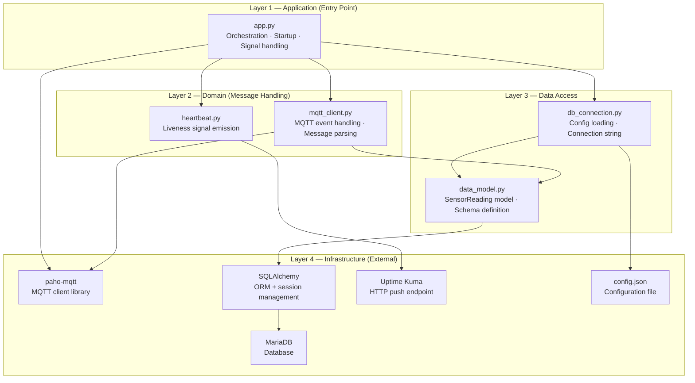
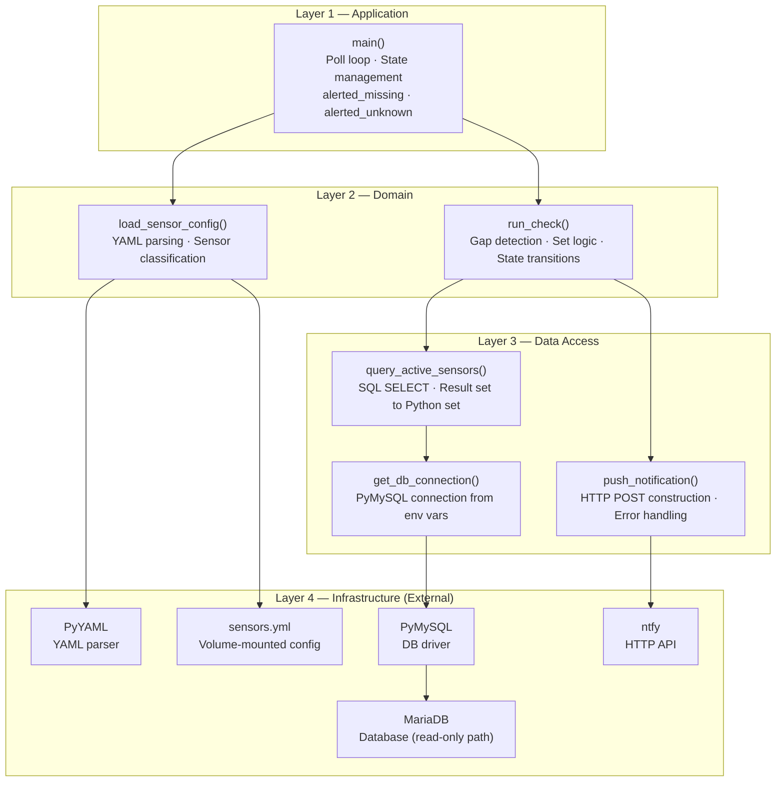

# View: Module Layers

**Viewtype:** Module — allowed dependencies
**Answers:** What are the structural layers and what dependency directions are permitted?
**Audience:** Developers, code reviewers
**Related NFRs:** NFR-MAIN-001 (testability), Constitution Principle VII (Minimal Surface Area)

Dependency rule: modules may only depend on modules in the same or lower layer. Upward dependencies (lower → higher) are prohibited.

---

## mqtt_logger Layers

### Layer Notes

**Layer 1 (Application):** `app.py` is the only allowed entry point. It imports from Layer 2 and Layer 3 but is itself imported by nothing. This layer is thin by design — it orchestrates but does not contain logic.

**Layer 2 (Domain):** Message handling and liveness emission. `mqtt_client.py` is the hot path. `heartbeat.py` is an independent thread with no dependency on `mqtt_client.py` — they share nothing except the process.

**Layer 3 (Data Access):** The data model and configuration are isolated from MQTT concerns. `data_model.py` knows nothing about MQTT topics — it only knows about `SensorReading` fields. This separation means the DB schema can evolve independently of the MQTT parsing logic.

**Layer 4 (Infrastructure):** Third-party libraries and external systems. No owned code lives here.

---

## companion_monitor Layers

### Layer Notes

**State isolation:** The `alerted_missing` and `alerted_unknown` sets live in `main()` scope only. `run_check()` receives them as mutable arguments — it does not own state. This design means the detection logic (`run_check`) can be tested in isolation by passing any state combination.

**No persistent DB connection:** `get_db_connection()` opens a new PyMySQL connection on each poll cycle and closes it immediately after the query. This avoids stale connection errors on the 5-minute interval. The overhead (connection setup) is negligible at this frequency.

---

## Cross-Container Dependency Rule

The two Python applications (`mqtt_logger` and `companion_monitor`) share no code, no shared volume, and no direct process communication. Their only shared resource is the MariaDB database, accessed via separate connections. This is intentional: `companion_monitor` must be able to operate even when `mqtt_logger` is down (that is the crash-detection scenario).
