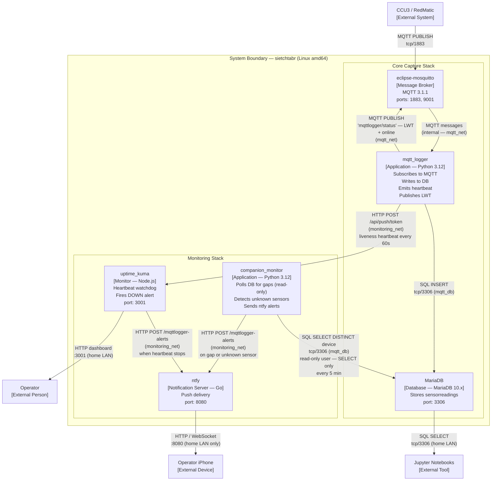

# View: Container (C4 Level 2)

**Viewtype:** Component-and-Connector — runtime structure
**Answers:** How is the system decomposed into deployable units and how do they communicate?
**Audience:** Technical stakeholders, architects
**Related NFRs:** NFR-PORT-001, NFR-REL-001, NFR-REL-002, NFR-SEC-001

---

## Diagram

---

## Container Descriptions

### eclipse-mosquitto — Message Broker
The MQTT broker. Receives all sensor readings published by CCU3/RedMatic and delivers them to mqtt_logger via the subscription. Co-hosted with all other containers on sietchtabr. Ports 1883 (MQTT) and 9001 (WebSocket) are exposed on the host.

### mqtt_logger — Core Capture Application
The primary service. Subscribes to the `environment/#` topic hierarchy, parses each received payload into a `SensorReading` record, and commits it to MariaDB. Also manages two monitoring mechanisms: it registers a Last Will and Testament (LWT) with the broker and runs a background heartbeat thread that pushes to Uptime Kuma every 60 seconds. Heartbeat is optional — silently skipped if `heartbeat_url` is absent from config. Connects to both `mqtt_net` (broker) and `mqtt_db` (database) and `monitoring_net` (Uptime Kuma).

### MariaDB — Persistent Store
Single relational database. The only persistent store in the system. All sensor readings go here; no secondary buffer exists. The `sensorreadings` table is the authoritative historical record. Port 3306 exposed to the home LAN for Jupyter notebook access. A healthcheck is configured so mqtt_logger does not start until the database is ready.

### uptime_kuma — Heartbeat Monitor (OPT-A)
Watches for the mqtt_logger heartbeat push. If no push arrives within 2× the configured interval (nominally 120 seconds), Uptime Kuma transitions the monitor to DOWN state and fires an alert to ntfy. Exposes a dashboard on port 3001 (LAN-accessible). Uptime Kuma owns the notification routing for OPT-A; it is configured via its web UI, not via code.

### ntfy — Push Notification Server
Self-hosted push server. Receives HTTP POST requests from both Uptime Kuma (OPT-A crash alerts) and companion_monitor (OPT-B gap/unknown alerts) and delivers them to the ntfy app on the operator's iPhone via the home LAN. Port 8080 exposed on the host. **LAN-only by design** — no cloud relay configured (RISK-023).

### companion_monitor — Sensor Gap Monitor (OPT-B)
Polls MariaDB every 5 minutes. Checks two directions: (1) sensors in the known configuration that have not published within the 600-minute gap window → silence alert; (2) sensors publishing to the DB that are not in the known configuration and not on the exclusion list → unknown sensor alert. Maintains in-memory state to fire alerts on state transitions only. Reads sensor configuration from `sensors.yml` (mounted as a volume). Connects to both `mqtt_db` and `monitoring_net`. **Uses a dedicated read-only MariaDB user** (`monitor_ro`) with `SELECT`-only privileges — enforces least-privilege access per NFR-INT-002 and ADR-009. Database queries filter on `captured_at` (feature 009 schema).

---

## Docker Networks

| Network | Containers | Purpose |
|---------|-----------|---------|
| `mqtt_net` | eclipse-mosquitto, mqtt_logger | MQTT publish/subscribe |
| `mqtt_db` | mqtt_logger, mariadb, companion_monitor | Database read/write |
| `monitoring_net` | mqtt_logger, uptime_kuma, ntfy, companion_monitor | Heartbeat push + alert delivery |

mqtt_logger spans all three networks. No container has internet access.
