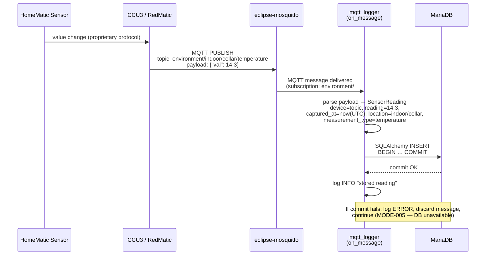
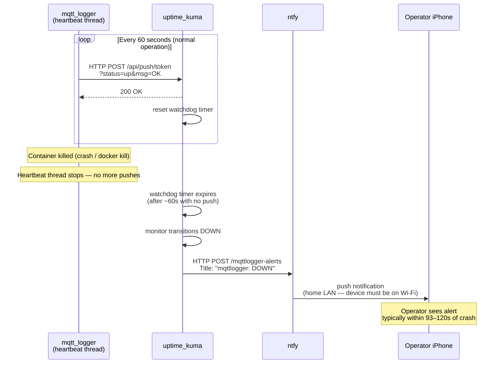
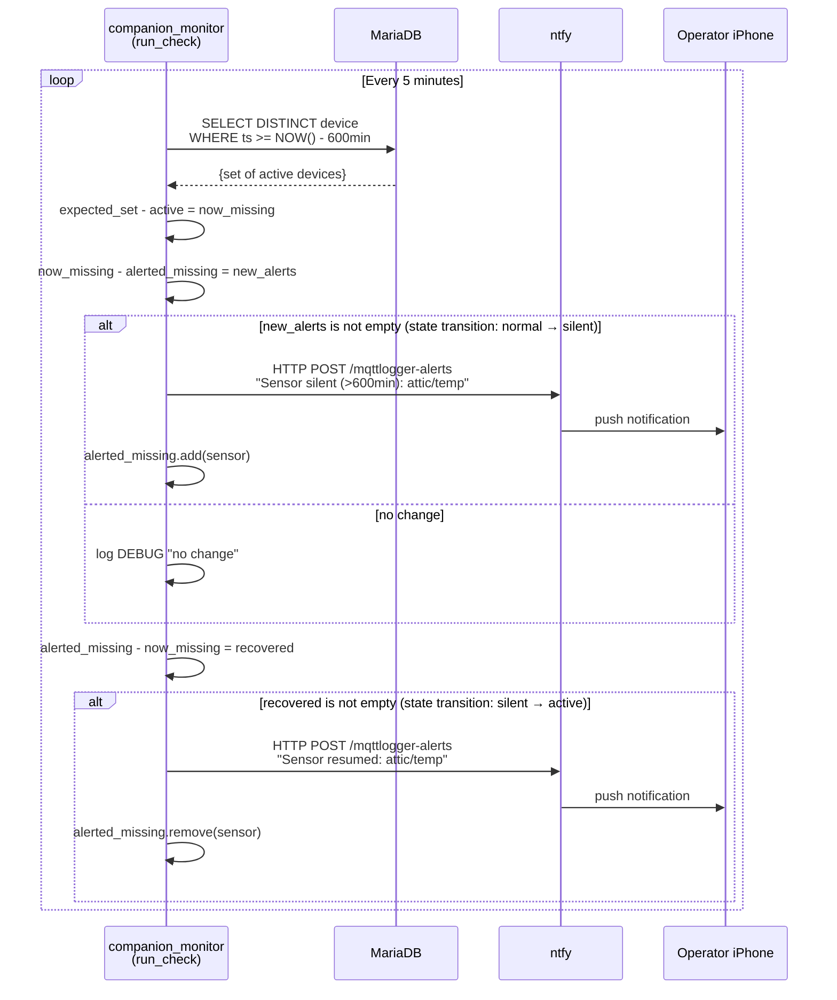
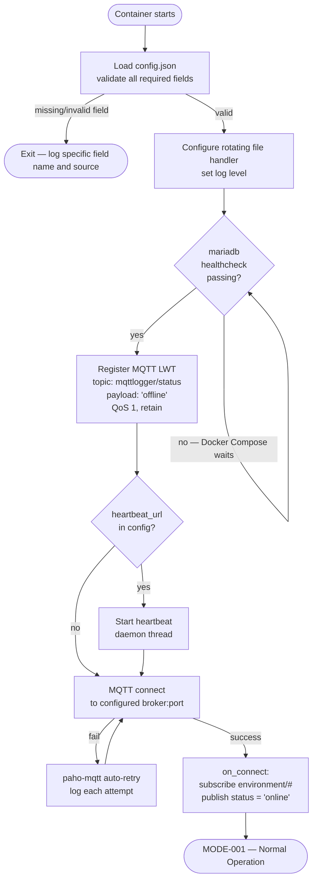
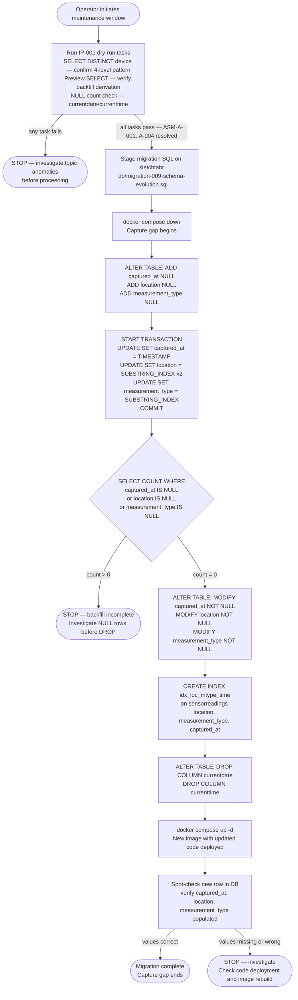
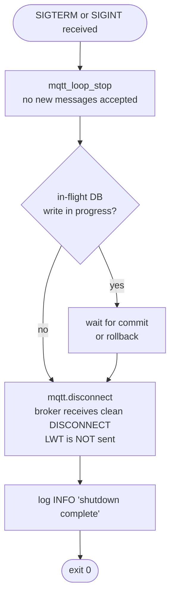

# View: Functional Flow

**Viewtype:** Component-and-Connector — behaviour over time
**Answers:** How do functions activate and interact for each key operational scenario?
**Audience:** Systems engineers, testers
**Related scenarios:** SCN-001, SCN-003 (with monitoring), SCN-005, SCN-008 (live schema migration)
**Last Updated:** 2026-05-17 (feature 009 — updated SCN-001 field names; added SCN-008 migration flow)

---

## Flow 1 — Normal Message Capture (SCN-001, MODE-001)

Shows the end-to-end path from sensor measurement to committed database record during steady-state operation.

---

## Flow 2 — Crash Detection and Notification (SCN-003 + OPT-A)

Shows how a silent container crash is detected and the operator is notified. Two sub-flows: the heartbeat path during normal operation, and the alert path after a crash.

---

## Flow 3 — Sensor Gap Detection and Notification (OPT-B, FR-MON-002)

Shows the companion monitor poll cycle detecting a sensor that has gone silent.

---

## Flow 4 — Startup and Connection Sequence (MODE-002)

Shows the orchestrated startup, including the mariadb healthcheck dependency and the LWT registration sequence.

---

## Flow 5 — Live Schema Migration (SCN-008, Feature 009)

Shows the operator-executed migration procedure that evolves the `sensorreadings` schema
from the legacy two-column timestamp representation to the unified `captured_at` column.
See ADR-008 for the decision rationale.

**Key properties of this flow:**
- The UPDATE backfill is transactional; if interrupted, all three column updates roll back together
- DDL (ADD/MODIFY/DROP COLUMN) auto-commits in MariaDB/InnoDB — the null-check is the gate between transactional backfill and irreversible schema changes
- The stack-down window encompasses both the migration and the `docker compose up -d` with new code; no intermediate state where old code runs against new schema

---

## Flow 6 — Graceful Shutdown (MODE-003)

