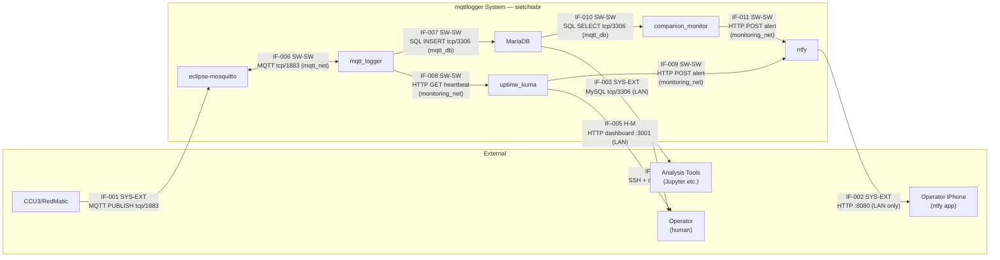

# Interface Control Document

**System:** mqttlogger
**Feature:** 004-remove-init-legacy (established; originally scoped for 002-mqttlogger-baseline)
**Date:** 2026-05-12
**Status:** DRAFT
**Last Updated By:** se-interfaces skill

---

## Purpose

This document defines all interfaces at every boundary of the mqttlogger system. It is the
authoritative reference for interface agreements between this system and external systems,
between containers within the system, and between the system and its operators.

Every interface listed here must have a corresponding verification entry in the V&V plan.

System type: software-only (no hardware-owned electronics or mechanical subsystems).
Applicable interface types: SYS-EXT, H-M, SW-SW.

---

## Interface Register

| IF ID | Name | Type | Provider | Consumer | Provider Ownership | Consumer Ownership | Status |
| ----- | ---- | ---- | -------- | -------- | ------------------ | ------------------ | ------ |
| IF-001 | MQTT sensor ingestion | SYS-EXT | CCU3/RedMatic | eclipse-mosquitto | External | Owned | Draft |
| IF-002 | Push notification delivery | SYS-EXT | ntfy | Operator iPhone | Owned | External | Draft |
| IF-003 | Database read access (external) | SYS-EXT | MariaDB | External analysis tools | Owned | External | Draft |
| IF-004 | Operator deployment and operations | H-M | System | Operator | Owned | External | Draft |
| IF-005 | Monitoring dashboard | H-M | uptime_kuma | Operator | Owned | External | Draft |
| IF-006 | MQTT broker ↔ logger | SW-SW | eclipse-mosquitto | mqtt_logger | Owned | Owned | Draft |
| IF-007 | Logger → database write | SW-SW | mqtt_logger | MariaDB | Owned | Owned | Draft |
| IF-008 | Logger → heartbeat monitor | SW-SW | mqtt_logger | uptime_kuma | Owned | Owned | Draft |
| IF-009 | Heartbeat monitor → notification server | SW-SW | uptime_kuma | ntfy | Owned | Owned | Draft |
| IF-010 | Sensor monitor → database read | SW-SW | MariaDB | companion_monitor | Owned | Owned | Draft |
| IF-011 | Sensor monitor → notification server | SW-SW | companion_monitor | ntfy | Owned | Owned | Draft |

---

## Interface Definitions

### IF-001 — MQTT Sensor Ingestion

**Type:** SYS-EXT
**Provider:** CCU3/RedMatic (external HomeMatic central controller)
**Consumer:** eclipse-mosquitto (owned MQTT broker container)
**Provider Ownership:** External — CCU3/RedMatic is a third-party device; its MQTT output
format is controlled by the RedMatic firmware and is not under this project's control.
**Consumer Ownership:** Owned
**Status:** Draft
**Requirement Source:** FR-001, FR-002, FR-013

#### Description

CCU3 (HomeMatic central controller running RedMatic) translates readings from HomeMatic IP
sensors into MQTT PUBLISH messages and delivers them to the Mosquitto broker on port 1883.
This is the system's sole sensor data ingestion path. The interface is fixed — no changes
to CCU3 or RedMatic are in scope for this project. Known issue: CCU3 publishes cached
zero values for all sensors on restart (RISK-012).

#### Protocol and Format

| Property | Value |
| -------- | ----- |
| Mechanism | MQTT 3.1.1 (OASIS standard) |
| Data Format | Raw value encoding: ASCII numeric string (e.g. `22.5`), or literal `true` / `false` |
| Direction | Provider → Consumer (unidirectional PUBLISH) |
| Timing | Asynchronous event-driven; sensor-defined publication interval (value-change or periodic; varies per sensor type; no contractual rate) |
| Authentication | None — broker is unauthenticated on the home LAN (by design; no public internet exposure) |
| Encryption | None — plaintext TCP/1883 on private LAN |

#### Data Elements

| Element | Type | Range/Values | Units | Description |
| ------- | ---- | ------------ | ----- | ----------- |
| topic | string | `environment/…/…/…/<reading_type>` | N/A | Full MQTT topic path; used as the `device` identifier in the database. Four-level hierarchy: concern / location-1 / location-2 / reading-type |
| payload | bytes | ASCII decimal float, `true`, or `false` | varies by sensor (°C, %, — ) | Raw sensor value. Numeric values are parsed as `float`. Boolean strings `true`/`false` are parsed as Python `bool` then cast to `float` (1.0 / 0.0) before DB insert. Any other payload is discarded with an error log. |

#### Error Handling

| Condition | Provider Behaviour | Consumer Behaviour |
| --------- | ------------------ | ------------------ |
| Broker unreachable | CCU3/RedMatic continues operating; messages are lost (no MQTT persistence configured) | eclipse-mosquitto is not reachable; no action needed on consumer side |
| Malformed payload | CCU3/RedMatic publishes as-is | mqtt_logger `on_message` logs an error and discards the message; capture continues |
| CCU3 restart (startup zeros) | Publishes zero values for all sensors (RISK-012) | Zeros are captured and stored as legitimate readings; no filtering applied |
| Sustained publish silence | CCU3 operational but sensor not publishing | companion_monitor detects gap after GAP_WINDOW_MINUTES; fires IF-011 alert |

#### Verification

**Verification Method:** T (Test)
**Verification Stage:** ST (System Test)
**Pass Criterion:** N messages published by CCU3 to `environment/#` → N records in the `sensorreadings` table with correct `device` (topic) and `reading` (parsed value). Malformed payloads produce no record and an error log entry.

#### External Reference

MQTT 3.1.1 specification: OASIS Standard, 2014. RedMatic payload format: no published specification; observed behaviour documented here and in `conops.md`.

---

### IF-002 — Push Notification Delivery

**Type:** SYS-EXT
**Provider:** ntfy container (self-hosted push notification server)
**Consumer:** Operator's iPhone (ntfy iOS app)
**Provider Ownership:** Owned
**Consumer Ownership:** External (operator device; iOS ntfy app)
**Status:** Draft
**Requirement Source:** FR-MON-001, FR-MON-002, FR-MON-003, FR-MON-004, FR-MON-006

#### Description

The ntfy container delivers push notifications to the operator's iPhone via the ntfy iOS
app. The iPhone subscribes to the topic `mqttlogger-alerts` on the ntfy server at its
LAN IP address. All monitoring alerts — crash detection (OPT-A via IF-009) and sensor gap
or unknown sensor detection (OPT-B via IF-011) — converge on this single delivery path.

**Critical constraint:** This interface functions only when the operator's iPhone is
connected to the home Wi-Fi network. Off-network delivery is not supported (RISK-023,
FR-MON-006 accepted limitation).

#### Protocol and Format

| Property | Value |
| -------- | ----- |
| Mechanism | HTTP/WebSocket; ntfy app maintains a persistent subscription connection to `http://<LAN-IP>:8080/mqttlogger-alerts` |
| Data Format | Push notification: title (string) + message body (string); delivered as iOS push notification |
| Direction | Provider → Consumer (server-push) |
| Timing | Near-real-time after ntfy receives the POST (sub-second); total latency dominated by detection window of IF-008 or IF-010 |
| Authentication | None — ntfy server is open on the home LAN (no auth configured; no public internet exposure) |
| Encryption | None — plaintext HTTP on private LAN |

#### Data Elements

| Element | Type | Range/Values | Units | Description |
| ------- | ---- | ------------ | ----- | ----------- |
| title | string | e.g. `mqttlogger alert`, `mqttlogger: sensor gap`, `mqttlogger: sensor recovery`, `mqttlogger: unknown sensor` | N/A | Alert category; shown as iOS notification header |
| message | string | Freeform text identifying the specific event | N/A | Human-readable description (e.g. `Sensor silent (>600min): environment/bedroom/temperature`) |

#### Error Handling

| Condition | Provider Behaviour | Consumer Behaviour |
| --------- | ------------------ | ------------------ |
| iPhone off home network | ntfy delivers to app when device reconnects to home LAN | Operator does not receive alert until reconnected; known limitation (RISK-023) |
| ntfy container restarted | Subscription drops; ntfy app reconnects automatically after restart | Operator may miss alerts during ntfy restart window |
| Alert flood | ntfy delivers all; no deduplication at this interface | companion_monitor state-transition logic (FR-MON-005) prevents flood at source |

#### Verification

**Verification Method:** D (Demonstration)
**Verification Stage:** AT (Acceptance Test — requires physical iPhone on home LAN)
**Pass Criterion:** When a monitored event fires (sensor silence, crash, recovery), a push notification arrives on the operator's iPhone within 30 seconds of the ntfy HTTP POST being received. Cannot be fully automated — requires physical device on home Wi-Fi.

#### External Reference

ntfy documentation: [https://docs.ntfy.sh](https://docs.ntfy.sh). iOS app: ntfy by Philipp C. Heckel (App Store).

---

### IF-003 — Database Read Access (External)

**Type:** SYS-EXT
**Provider:** MariaDB container (owned)
**Consumer:** External analysis tools (e.g. Jupyter Notebooks, any MySQL-compatible client)
**Provider Ownership:** Owned
**Consumer Ownership:** External
**Status:** Draft
**Requirement Source:** No functional requirement (downstream consumer; referenced in ConOps external dependents)

#### Description

MariaDB port 3306 is exposed to the home LAN, allowing external SQL clients to read
the `sensorreadings` table for ad-hoc analysis. This is a read-only consumer path;
no external tool has write access beyond what credentials allow. The schema is owned
by mqttlogger (`data_model.py`); any schema change requires a migration script
(NFR-INT-001).

#### Protocol and Format

| Property | Value |
| -------- | ----- |
| Mechanism | MySQL wire protocol, tcp/3306 |
| Data Format | SQL query/result; table schema defined by `data_model.py::SensorReading` |
| Direction | Bidirectional (query from consumer; result from provider) |
| Timing | Synchronous request-response; no SLA defined for ad-hoc analysis queries |
| Authentication | Database user credentials (username + password from MariaDB config) |
| Encryption | None — plaintext MySQL on private LAN |

#### Data Elements (sensorreadings schema)

| Element | Type | Range/Values | Units | Description |
| ------- | ---- | ------------ | ----- | ----------- |
| id | Integer (PK) | autoincrement | N/A | Row identifier |
| currentdate | Date | YYYY-MM-DD | N/A | Capture date (host clock, UTC offset not recorded) |
| currenttime | Time | HH:MM:SS | N/A | Capture time (host clock, UTC offset not recorded) |
| device | Text | MQTT topic path string | N/A | Full MQTT topic of the source sensor |
| reading | Float | any float | varies by sensor | Parsed sensor value (temperature, humidity, boolean cast to 0.0/1.0, etc.) |

#### Error Handling

| Condition | Provider Behaviour | Consumer Behaviour |
| --------- | ------------------ | ------------------ |
| Consumer disconnects mid-query | MariaDB closes connection; no impact on system | Client reconnects and retries |
| Schema change (migration) | Schema changes applied via migration script; read consumers may break | External consumer must adapt to new schema |

#### Verification

**Verification Method:** I (Inspection)
**Verification Stage:** — (no runtime stage)
**Pass Criterion:** Port 3306 is exposed in `docker-compose.yml`; MariaDB credentials are not committed to version control; `sensorreadings` table schema matches `data_model.py::SensorReading`.

#### External Reference

MariaDB documentation. Schema definition: `mqttlogger/data_model.py`.

---

### IF-004 — Operator Deployment and Operations

**Type:** H-M
**Provider:** System (all containers; config file; log files)
**Consumer:** Operator (sole human user)
**Provider Ownership:** Owned
**Consumer Ownership:** External (human)
**Status:** Draft
**Requirement Source:** FR-008, FR-009, FR-010, FR-011, FR-012, FR-006

#### Description

The operator's sole interaction surface with the running system. This interface covers:
deployment (`docker compose up -d`), configuration (editing `config.json` and
`sensors.yml`), log inspection (`docker compose exec mqtt_logger tail -f …`), and
diagnostic operations (container restart, credential rotation). There is no GUI.

#### Protocol and Format

| Property | Value |
| -------- | ----- |
| Mechanism | SSH to host `sietchtabr`; Docker Compose CLI; text editor for config files |
| Data Format | Plain text (config JSON, log lines, YAML); Docker Compose YAML |
| Direction | Bidirectional (operator provides config; system provides logs, status) |
| Timing | Synchronous (CLI commands); log output is real-time tail |
| Authentication | SSH key authentication to sietchtabr |
| Encryption | SSH (encrypted transport) |

#### Data Elements (operator inputs)

| Element | Type | Range/Values | Units | Description |
| ------- | ---- | ------------ | ----- | ----------- |
| config.json | JSON file | broker host/port, DB credentials, topic, heartbeat_url | N/A | Runtime configuration; gitignored |
| sensors.yml | YAML file | monitored sensor list, excluded sensor list | N/A | companion_monitor configuration; gitignored |
| docker compose commands | CLI | up, down, restart, logs, exec | N/A | Lifecycle management |

#### Error Handling

| Condition | Provider Behaviour | Consumer Behaviour |
| --------- | ------------------ | ------------------ |
| Invalid config.json | mqtt_logger exits with specific error message naming field and source (FR-011) | Operator reads error; corrects config; restarts container |
| Missing credentials | Same as above | Operator provides credentials; restarts |

#### Verification

**Verification Method:** D (Demonstration)
**Verification Stage:** ST (System Test)
**Pass Criterion:** `docker compose up -d` on a clean host brings all 6 containers to healthy state; logger captures a test message; log file shows all required fields (FR-006); invalid config produces specific error (FR-011).

#### External Reference

Docker Compose documentation. Log format: Python `logging.Formatter` in `app.py`.

---

### IF-005 — Monitoring Dashboard

**Type:** H-M
**Provider:** uptime_kuma container (web UI)
**Consumer:** Operator (via browser on home LAN)
**Provider Ownership:** Owned
**Consumer Ownership:** External (human)
**Status:** Draft
**Requirement Source:** FR-MON-001 (visibility of crash detection state)

#### Description

Uptime Kuma exposes a web dashboard on port 3001 (home LAN). The operator uses this to
verify that the heartbeat push monitor is configured correctly and to inspect the current
status of the mqtt_logger process. The dashboard is the secondary visibility channel;
the primary alert channel is the iPhone push notification via IF-002.

#### Protocol and Format

| Property | Value |
| -------- | ----- |
| Mechanism | HTTP; browser on home LAN to `http://sietchtabr:3001` |
| Data Format | HTML/CSS/JS (web application) |
| Direction | Provider → Consumer (read-only dashboard) |
| Timing | Real-time; polling or WebSocket refresh |
| Authentication | Uptime Kuma local admin account (credentials stored in UK data volume; not version-controlled) |
| Encryption | None — plaintext HTTP on private LAN |

#### Verification

**Verification Method:** D (Demonstration)
**Verification Stage:** ST
**Pass Criterion:** Browser on home LAN to `http://sietchtabr:3001` shows the push monitor for mqtt_logger in UP state during normal operation; shows DOWN state within 120 seconds of container kill.

#### External Reference

Uptime Kuma documentation: https://github.com/louislam/uptime-kuma

---

### IF-006 — MQTT Broker ↔ Logger

**Type:** SW-SW
**Provider:** eclipse-mosquitto (broker; delivers messages; accepts LWT registration)
**Consumer:** mqtt_logger (subscribes; receives messages; publishes status; registers LWT)
**Provider Ownership:** Owned
**Consumer Ownership:** Owned
**Status:** Draft
**Requirement Source:** FR-001, FR-002, FR-004, FR-006, FR-007, FR-013

#### Description

The internal MQTT interface between the Mosquitto broker and the mqtt_logger service on
the `mqtt_net` Docker network. This interface carries three logical flows: (1) message
delivery from broker to logger (sensor data captured from IF-001); (2) status publication
from logger to broker (online/offline LWT); (3) LWT registration at connect time.

#### Protocol and Format

| Property | Value |
| -------- | ----- |
| Mechanism | MQTT 3.1.1; internal Docker network `mqtt_net`; tcp/1883 |
| Data Format | MQTT protocol frames; payload encoding per IF-001 |
| Direction | Bidirectional (broker delivers to logger; logger publishes status to broker) |
| Timing | Asynchronous event-driven delivery; no guaranteed latency (co-hosted: sub-ms typical) |
| Authentication | None (internal Docker network; no internet exposure) |
| Encryption | None (internal Docker network) |

#### Data Elements

| Element | Type | Range/Values | Units | Description |
| ------- | ---- | ------------ | ----- | ----------- |
| SUBSCRIBE topic filter | string | `environment/#` | N/A | Wildcard subscription; matches all sensor topics |
| Inbound message topic | string | Full topic path | N/A | Delivered to `on_message` callback as `message.topic` |
| Inbound message payload | bytes | ASCII float, `true`, `false` | varies | Delivered as `message.payload`; parsed per IF-001 |
| LWT topic | string | `mqttlogger/status` | N/A | Broker publishes LWT here on unexpected disconnect |
| LWT payload | string | `"offline"` | N/A | Retained message; signals unexpected disconnect |
| Status publish payload | string | `"online"` | N/A | Published on successful connect; QoS 1, retained |
| Reconnect behaviour | — | Indefinite retry | N/A | paho-mqtt loop reconnects automatically (FR-004) |

#### Error Handling

| Condition | Provider Behaviour | Consumer Behaviour |
| --------- | ------------------ | ------------------ |
| Logger loses broker connection | Broker detects clean/unclean disconnect; publishes LWT if unclean | paho-mqtt reconnect loop retries indefinitely (FR-004); no operator action |
| Broker unavailable at startup | N/A | paho-mqtt retries connection; mqtt_logger does not exit |
| Broker restart | Broker accepts new connections after restart | Logger reconnects and re-subscribes in `on_connect` (FR-004) |

#### Verification

**Verification Method:** T (Test) / D (Demonstration)
**Verification Stage:** ST
**Pass Criterion:** (T) N messages published → N DB records; (D) broker restart → logger reconnects and resumes capture without operator action; kill logger → broker topic `mqttlogger/status` retains value `"offline"`.

#### External Reference

MQTT 3.1.1 specification (OASIS). paho-mqtt Python client documentation.

---

### IF-007 — Logger → Database Write

**Type:** SW-SW
**Provider:** mqtt_logger (`mqtt_client.py::insert()`)
**Consumer:** MariaDB (`sensorreadings` table)
**Provider Ownership:** Owned
**Consumer Ownership:** Owned
**Status:** Draft
**Requirement Source:** FR-003, FR-005

#### Description

mqtt_logger writes one `SensorReading` record to MariaDB for every successfully parsed
MQTT message. The write is synchronous and occurs directly inside the `on_message`
callback before the callback returns (ADR-001). If the write fails, the error is logged
and the message is discarded; the logger does not exit (ADR-003).

#### Protocol and Format

| Property | Value |
| -------- | ----- |
| Mechanism | SQLAlchemy ORM → PyMySQL driver → MariaDB wire protocol; internal Docker network `mqtt_db`; tcp/3306 |
| Data Format | SQL INSERT; one row per message; schema defined by `data_model.py::SensorReading` |
| Direction | Provider → Consumer (write) |
| Timing | Synchronous; each INSERT must commit before `on_message` returns; no buffering (ADR-001) |
| Authentication | MariaDB username + password from `config.json` |
| Encryption | None (internal Docker network) |

#### Data Elements

| Element | Type | Range/Values | Units | Description |
| ------- | ---- | ------------ | ----- | ----------- |
| currentdate | Date | YYYY-MM-DD | N/A | `datetime.now().strftime("%Y-%m-%d")` at parse time (host UTC clock) |
| currenttime | Time | HH:MM:SS | N/A | `datetime.now().strftime("%H:%M:%S")` at parse time |
| device | Text | Full MQTT topic string | N/A | `message.topic` verbatim |
| reading | Float | any float | varies | Parsed value from payload |

#### Error Handling

| Condition | Provider Behaviour | Consumer Behaviour |
| --------- | ------------------ | ------------------ |
| DB connection refused at startup | mqtt_logger blocks until DB available (Docker Compose `depends_on: service_healthy`) | N/A — healthcheck gate prevents logger from starting before DB is ready |
| INSERT failure during operation | Log error; discard message; return from callback; continue (ADR-003) | MariaDB records nothing for this message |
| DB temporarily unreachable | Same as INSERT failure per message | MariaDB unavailable; reads/writes fail until restored |

#### Verification

**Verification Method:** T (Test)
**Verification Stage:** ST
**Pass Criterion:** N messages published → N rows committed to `sensorreadings`; make DB unreachable → service continues running; error logged per failed INSERT; no exit.

#### External Reference

SQLAlchemy documentation. Schema: `mqttlogger/data_model.py::SensorReading`.

---

### IF-008 — Logger → Heartbeat Monitor

**Type:** SW-SW
**Provider:** mqtt_logger heartbeat daemon thread (`heartbeat.py::start_heartbeat()`)
**Consumer:** uptime_kuma (push monitor endpoint)
**Provider Ownership:** Owned
**Consumer Ownership:** Owned
**Status:** Draft
**Requirement Source:** FR-014, FR-MON-001

#### Description

The mqtt_logger heartbeat thread issues an HTTP GET to the Uptime Kuma push endpoint
every 60 seconds (default; configurable via `heartbeat_url` in `config.json`). Uptime
Kuma uses the presence of these pushes to determine logger liveness. If the thread stops
(because the logger process has crashed), Uptime Kuma transitions to DOWN after 2× the
monitor interval and fires an alert via IF-009.

The heartbeat proves **process liveness only** — a stuck thread that is alive but not
writing to the database would still send heartbeats (RISK-020, ADR-006).

#### Protocol and Format

| Property | Value |
| -------- | ----- |
| Mechanism | HTTP GET; `urllib.request.urlopen(url, timeout=10)`; internal Docker network `monitoring_net`; tcp/3001 |
| Data Format | URL-encoded parameters on the Uptime Kuma push endpoint: `?status=up&msg=OK` (appended by UK URL convention) |
| Direction | Provider → Consumer |
| Timing | Periodic: every `heartbeat_interval_seconds` (default 60 s); first push fires at thread start |
| Authentication | URL-embedded push token (generated by Uptime Kuma; stored in `heartbeat_url` in `config.json`) |
| Encryption | None (internal Docker network) |

#### Data Elements

| Element | Type | Range/Values | Units | Description |
| ------- | ---- | ------------ | ----- | ----------- |
| heartbeat_url | string | `http://uptime_kuma:3001/api/push/{token}?status=up&msg=OK&ping=` | N/A | Full push endpoint URL; configured in `config.json`; includes embedded auth token |
| HTTP response | integer | 200 OK | N/A | Non-200 or connection error is logged as WARNING; heartbeat loop continues |

#### Error Handling

| Condition | Provider Behaviour | Consumer Behaviour |
| --------- | ------------------ | ------------------ |
| uptime_kuma unreachable | Log warning; continue loop on next interval | N/A |
| Logger process crash | Thread exits; no more pushes | uptime_kuma times out after 2× interval; fires alert via IF-009 |
| heartbeat_url absent from config | Thread not started; heartbeat silently skipped (FR-014) | uptime_kuma never receives pushes; must not be configured in this case |

#### Verification

**Verification Method:** T (Test) / D (Demonstration)
**Verification Stage:** IT / ST
**Pass Criterion:** (T) heartbeat thread sends HTTP GET to configured URL at configured interval; no error when URL is absent. (D) Kill logger → no heartbeat → uptime_kuma fires DOWN alert within 120 s.

#### External Reference

Uptime Kuma push monitor documentation. `mqttlogger/heartbeat.py`.

---

### IF-009 — Heartbeat Monitor → Notification Server

**Type:** SW-SW
**Provider:** uptime_kuma (alert routing; configured via web UI)
**Consumer:** ntfy (`/mqttlogger-alerts` topic endpoint)
**Provider Ownership:** Owned
**Consumer Ownership:** Owned
**Status:** Draft
**Requirement Source:** FR-MON-001

#### Description

When Uptime Kuma's push monitor transitions to DOWN (no heartbeat received within 2×
the monitor interval), it fires an HTTP POST to the ntfy server at the `/mqttlogger-alerts`
topic. This alert is then delivered to the operator via IF-002. The Uptime Kuma
notification configuration (ntfy URL, alert text) is set via the Uptime Kuma web UI and
stored in the UK data volume — it is **not version-controlled** (see risk entry below).

#### Protocol and Format

| Property | Value |
| -------- | ----- |
| Mechanism | HTTP POST; Uptime Kuma ntfy notification provider; internal Docker network `monitoring_net`; tcp/80 |
| Data Format | ntfy HTTP API; `Content-Type: text/plain`; body = alert message; optional Title header |
| Direction | Provider → Consumer |
| Timing | Triggered on state transition (UP→DOWN, DOWN→UP); not periodic |
| Authentication | None (internal Docker network) |
| Encryption | None (internal Docker network) |

#### Data Elements

| Element | Type | Range/Values | Units | Description |
| ------- | ---- | ------------ | ----- | ----------- |
| ntfy URL | string | `http://ntfy:80/mqttlogger-alerts` | N/A | Configured in Uptime Kuma web UI |
| message body | string | Uptime Kuma-generated alert text | N/A | DOWN or UP notification text |

#### Error Handling

| Condition | Provider Behaviour | Consumer Behaviour |
| --------- | ------------------ | ------------------ |
| ntfy unreachable | Uptime Kuma logs notification failure; retries per UK config | No alert delivered; operator unaware of crash |
| UK configuration lost (volume deleted) | Push monitor must be manually reconfigured | IF-008 pushes arrive but are silently accepted without routing to ntfy |

#### Verification

**Verification Method:** D (Demonstration)
**Verification Stage:** ST
**Pass Criterion:** Kill mqtt_logger; within 120 seconds, ntfy receives a POST to `/mqttlogger-alerts` and the notification appears on the operator's iPhone (combined with IF-002 test).

#### External Reference

ntfy HTTP API: https://docs.ntfy.sh/publish/. Uptime Kuma notification providers documentation.

---

### IF-010 — Sensor Monitor → Database Read

**Type:** SW-SW
**Provider:** MariaDB (`sensorreadings` table)
**Consumer:** companion_monitor (`query_active_sensors()`)
**Provider Ownership:** Owned
**Consumer Ownership:** Owned
**Status:** Draft
**Requirement Source:** FR-MON-002, FR-MON-003, FR-MON-004, FR-MON-005

#### Description

companion_monitor polls MariaDB every 300 seconds (default; configurable via
`POLLING_INTERVAL_SECONDS`). Each poll issues one SQL SELECT to retrieve the set of
distinct `device` values that have published within the last `GAP_WINDOW_MINUTES` (default
10; production calibrated to 600). The result set is compared against the known sensor
configuration to detect silence and unknown sensors. A new PyMySQL connection is opened
per poll cycle and closed immediately after the query (avoids stale connection on 5-minute
idle intervals).

#### Protocol and Format

| Property | Value |
| -------- | ----- |
| Mechanism | PyMySQL driver → MariaDB wire protocol; internal Docker network `mqtt_db`; tcp/3306 |
| Data Format | SQL SELECT; returns a result set of string values |
| Direction | Bidirectional (query from consumer; result set from provider) |
| Timing | Periodic; one query per `POLLING_INTERVAL_SECONDS` (default 300 s); synchronous blocking query |
| Authentication | Database user credentials from environment variables (`DB_USER`, `DB_PASSWORD`) |
| Encryption | None (internal Docker network) |

#### Data Elements

| Element | Type | Range/Values | Units | Description |
| ------- | ---- | ------------ | ----- | ----------- |
| SQL query | string | `SELECT DISTINCT device FROM sensorreadings WHERE TIMESTAMP(currentdate, currenttime) >= DATE_SUB(NOW(), INTERVAL %s MINUTE)` | N/A | Parameterized; parameter = `GAP_WINDOW_MINUTES` |
| result set | set[string] | MQTT topic strings | N/A | Devices that have published within the gap window |
| GAP_WINDOW_MINUTES | integer | 10 (default); 600 (production) | minutes | Gap detection window; configurable via env var |

#### Error Handling

| Condition | Provider Behaviour | Consumer Behaviour |
| --------- | ------------------ | ------------------ |
| DB connection fails | MariaDB not reachable | Log error; return from `run_check()`; retry on next poll cycle; no alert fired |
| DB query timeout | MariaDB returns error after `connect_timeout=10s` | Same as connection failure |
| Empty result set (all sensors silent) | MariaDB returns zero rows | All monitored sensors treated as missing; alerts fire per transition logic |

#### Verification

**Verification Method:** T (Test)
**Verification Stage:** IT
**Pass Criterion:** Sustain a sensor silence for more than one poll cycle; verify exactly one alert notification is sent (state transition logic); verify one recovery notification when sensor resumes.

#### External Reference

PyMySQL documentation. Schema: `mqttlogger/data_model.py::SensorReading`. companion_monitor query: `companion-monitor/monitor.py::query_active_sensors()`.

---

### IF-011 — Sensor Monitor → Notification Server

**Type:** SW-SW
**Provider:** companion_monitor (`push_notification()`)
**Consumer:** ntfy (`/mqttlogger-alerts` topic endpoint)
**Provider Ownership:** Owned
**Consumer Ownership:** Owned
**Status:** Draft
**Requirement Source:** FR-MON-002, FR-MON-003, FR-MON-004, FR-MON-006

#### Description

companion_monitor sends HTTP POST requests to the ntfy server when a state transition
is detected: sensor silence, sensor recovery, or new unknown sensor. The notification
URL is configured via the `NTFY_URL` environment variable. If `NTFY_URL` is not set, the
notification is suppressed with a warning log (no error exit). Alerts fire on state
transition only — the in-memory sets `alerted_missing` and `alerted_unknown` enforce
exactly-once alerting per event (FR-MON-005).

#### Protocol and Format

| Property | Value |
| -------- | ----- |
| Mechanism | HTTP POST; `urllib.request.Request` with `method="POST"`; internal Docker network `monitoring_net`; tcp/80 |
| Data Format | ntfy HTTP API; body = plain text message; `Title` header = alert category string |
| Direction | Provider → Consumer |
| Timing | Triggered on state transition; not periodic |
| Authentication | None (internal Docker network) |
| Encryption | None (internal Docker network) |

#### Data Elements

| Element | Type | Range/Values | Units | Description |
| ------- | ---- | ------------ | ----- | ----------- |
| NTFY_URL | string | `http://ntfy:80/mqttlogger-alerts` | N/A | Full ntfy topic endpoint; from `NTFY_URL` env var |
| Title header | string | `mqttlogger: sensor gap` / `mqttlogger: sensor recovery` / `mqttlogger: unknown sensor` | N/A | Alert type shown as notification header |
| message body | string | e.g. `Sensor silent (>600min): environment/attic/humidity` | N/A | Human-readable description including sensor topic |

#### Error Handling

| Condition | Provider Behaviour | Consumer Behaviour |
| --------- | ------------------ | ------------------ |
| ntfy unreachable | Log error; return; poll loop continues; no retry | No alert delivered; operator unaware of event |
| NTFY_URL not set | Log warning; suppress notification | ntfy never called |
| HTTP non-200 response | Log error; continue | Same as unreachable |

#### Verification

**Verification Method:** T (Test) / D (Demonstration)
**Verification Stage:** IT / ST
**Pass Criterion:** (T) Sustain sensor silence for >GAP_WINDOW cycles; verify exactly one POST to ntfy topic per silence event and one POST per recovery. (D) IP-001 validation evidence: attic humidity silence detected and recovery notification confirmed.

#### External Reference

ntfy HTTP API: https://docs.ntfy.sh/publish/. companion_monitor: `companion-monitor/monitor.py::push_notification()`.

---

## Interface Matrix

---

## Open Interface Issues

| Issue ID | Interface | Issue Description | Owner | Target Resolution |
| -------- | --------- | ----------------- | ----- | ----------------- |
| IIF-OI-001 | IF-009 | Uptime Kuma notification configuration (ntfy URL, alert text, push token) is set via web UI and stored in the UK data volume — it is not version-controlled. Loss of the volume requires manual reconfiguration. | Chris | Document reconfiguration procedure; consider `docker volume backup` in operational runbook. No code change required. |
| IIF-OI-002 | IF-001 | MQTT payload format from CCU3/RedMatic is not formally specified; observed format is documented here. If RedMatic firmware update changes encoding, logger may silently store incorrect values. | Chris | Monitor RedMatic release notes; add payload format check to companion_monitor future scope. |

---

## External Specifications Referenced

| Reference ID | Document Title | Version | Owner | Location |
| ------------ | -------------- | ------- | ----- | -------- |
| EXT-001 | MQTT Version 3.1.1 | OASIS Standard 2014 | OASIS | https://docs.oasis-open.org/mqtt/mqtt/v3.1.1/os/mqtt-v3.1.1-os.html |
| EXT-002 | ntfy HTTP API | Current | Philipp C. Heckel | https://docs.ntfy.sh/publish/ |
| EXT-003 | Uptime Kuma documentation | Current | Louis Lam | https://github.com/louislam/uptime-kuma |
| EXT-004 | SQLAlchemy documentation | 1.4.x | SQLAlchemy | https://docs.sqlalchemy.org/en/14/ |
| EXT-005 | PyMySQL documentation | Current | PyMySQL contributors | https://pymysql.readthedocs.io/ |
| EXT-006 | paho-mqtt Python client | Current | Eclipse Foundation | https://eclipse.dev/paho/index.php?page=clients/python/docs/index.php |
